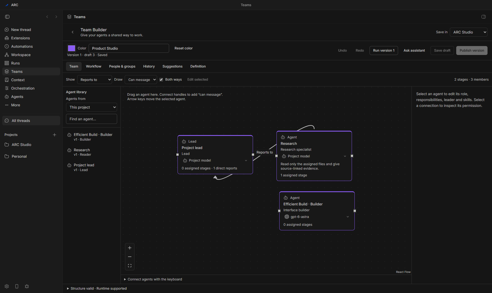
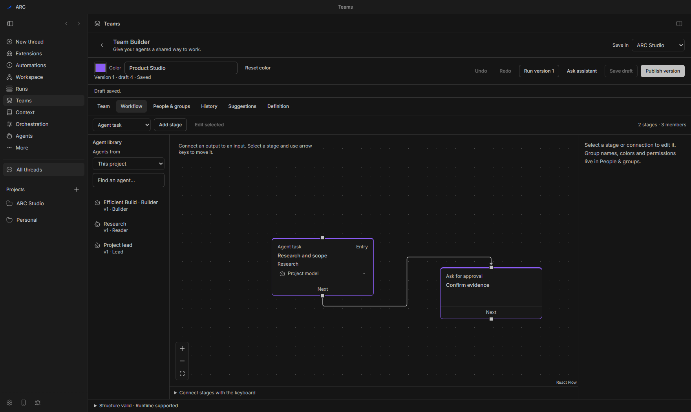
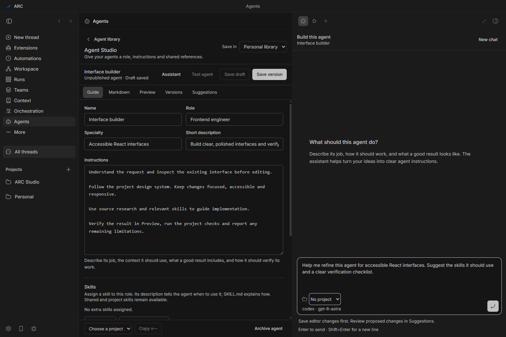
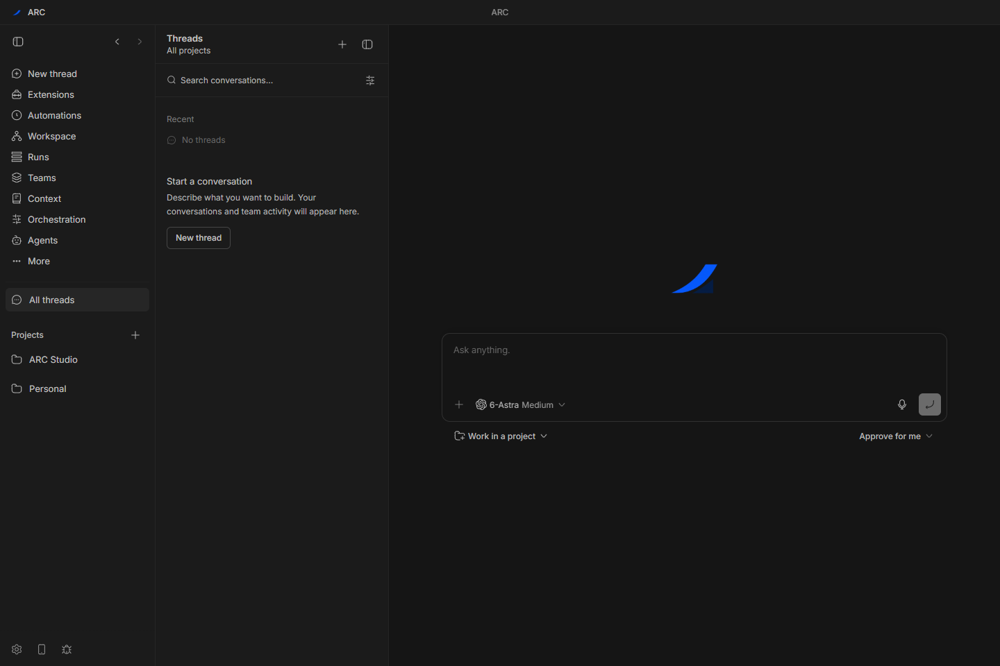

<p align="center">
  
</p>

<h1 align="center">ARC IDE</h1>

<p align="center"><strong>Your team. Your models. One workspace.</strong></p>

<p align="center">
  Build an agent team, give it work in chat, follow the collaboration,<br>
  and test what it builds without leaving your workspace.
</p>

<p align="center">
  <a href="docs/arc-mvp-status.md"></a>
  <a href="docs/arc-windows.md"></a>
  <a href="package.json"></a>
  <a href="LICENSE"></a>
</p>

<p align="center">
  <a href="#inside-arc">Features</a> ·
  <a href="#a-closer-look">Screenshots</a> ·
  <a href="#get-started">Get started</a> ·
  <a href="#verification">Verification</a> ·
  <a href="#documentation">Docs</a>
</p>



<p align="center"><sub>Actual ARC desktop capture with editable example data. <a href="docs/assets/readme/provenance.md">Screenshot provenance</a></sub></p>

## Inside ARC

ARC is a Windows workspace for building software with the coding providers you connect. Conversations, visual teams, code, terminals, shared Context and a live Preview belong to the same workflow.

|                                 | What you can do                                                                                                                                                                            |
| ------------------------------- | ------------------------------------------------------------------------------------------------------------------------------------------------------------------------------------------ |
| **Build your team**             | Drag agents onto a canvas, name and color the team, assign leaders and responsibilities, and change models directly in the builder. Cards show the model and its provider logo.            |
| **Make collaboration explicit** | Connect reporting, messaging, delegation and review permissions. Switch to Workflow to define order, parallel work, checks and bounded repair. Hierarchy alone never grants permission.    |
| **Give agents skills**          | Assign standard `SKILL.md` folders, supporting files and reusable instructions in Agent Studio. Published revisions pin the assigned contents so edits do not silently change active runs. |
| **Address work in chat**        | Choose `@Team` or `@Agent` recipients, then press Send. Inspect worker conversations, reports, messages and results within one coordinated run and shared budget.                          |
| **Test in Preview**             | Start, stop and restart local apps; open URLs and HTML; inspect elements; and attach a screenshot or selection to chat. Take over browser control whenever you need to.                    |
| **Stay in your workspace**      | Use terminals and shared Context alongside persistent composer drafts, an agent-building assistant, a custom title bar, theme palettes and optional Liquid Glass.                          |

### Start with Efficient Build

Use the bundled team as a starting point, then make it yours. Setup creates editable project copies and asks you to choose connected models and your project's verification command. Template updates never overwrite your customizations.

| Role         | Responsibility                                                        |
| ------------ | --------------------------------------------------------------------- |
| **Lead**     | Understand the request, plan, delegate and bring the result together. |
| **Reader**   | Inspect source material and return concise findings with references.  |
| **Builder**  | Implement scoped changes using the team's skills and findings.        |
| **Reviewer** | Independently inspect the combined candidate and required checks.     |

ARC reports available usage by role and model; missing counters remain **Unavailable**. Teams are a coordination tool, and no fixed token savings are promised.

## A closer look

### Design the work as well as the team

The linked Workflow view makes assignments and dependencies visible. Team membership, model choices and execution rules stay in one versioned definition.



### Build agents with an assistant beside you

Configure instructions, models, permissions and skills in Agent Studio. The assistant helps shape the definition through a draft you can review.



### A quiet place to start

New threads open with a centered composer and the ARC mark. Drafts persist, and recipients stay visible as the conversation continues.



## Get started

### Windows installer

**Public download pending.** An unsigned `ARC-0.42.10-x64.exe` candidate has been built and its unpacked application verified. The guarded install/reinstall/uninstall test is still incomplete because it protects an existing ARC setup on the test PC. The candidate is not being published as a verified installer.

See the [MVP verification status](docs/arc-mvp-status.md) for the exact source, candidate checksum, passed checks and remaining gate. Future verified binaries will appear in this repository's [Releases](https://github.com/grandmasterhilbertporcupine/ARC-IDE/releases).

The installer provides installation-folder, Desktop shortcut and Start-menu choices. Electron, ARC's private Node runtime, the frontend, local server, daemon, CLI, plugins and Context assets are bundled. **Git and coding-provider installation/authentication remain external prerequisites.** npm-based provider setup also needs external Node/npm; ARC's private runtime does not install npm globally.

Unsigned builds may trigger Windows' unknown-publisher warning. Check the source and supplied SHA-256 before running one. A checksum identifies the file; it does not establish a verified publisher. Read the [Windows guide](docs/arc-windows.md) before installing a local candidate.

### Run from source

The verified Windows toolchain is **Node 24.14**, **pnpm 9.15.0** and Git. Native dependencies may require Visual Studio Build Tools with C++ support and the Windows SDK.

```powershell
git clone https://github.com/grandmasterhilbertporcupine/ARC-IDE.git
cd ARC-IDE
corepack pnpm install --frozen-lockfile --child-concurrency=1 --network-concurrency=4
corepack pnpm dev
```

Open the URL printed by the launcher. Development data is isolated per checkout under `~/.arc-dev/`; packaged ARC uses `~/.arc/`. WNDR data is not imported automatically. For native desktop development, use `corepack pnpm dev:desktop` in a second terminal after the development services are ready.

1. Open **Settings → Providers** and connect or install your coding provider, then sign in.
2. Open a project and start a thread, or choose **Efficient Build** in Team Builder.
3. Select the team's models and project verification command; review and publish its definition.
4. Choose the published `@Team` in a project conversation and send your request.
5. Inspect the run's changes, checks and review, then test the result in **Preview**.

See the [visual teams, skills and Preview guide](docs/ARC-VISUAL-TEAMS.md) for the complete workflow and matching CLI/SDK operations.

### Updates

Packaged stable Windows builds are configured to check this repository's public GitHub Releases at startup, periodically and through **Settings → Updates**. Receiving an update does not require GitHub sign-in. There are no published update assets for this candidate, and cross-version upgrades are not yet certified. Earlier builds with updates disabled need a one-time manual installation of a GitHub-enabled build.

## Verification

The frozen application source at [`32ded96`](https://github.com/grandmasterhilbertporcupine/ARC-IDE/commit/32ded9637edca58315157a3496a72c02767980ee) passed the shared source gate, production packaging and all five required packaged checks. The README and gallery are a later documentation update; the installer remains bound to that exact source.

| Gate                                                                    | Local result                                             |
| ----------------------------------------------------------------------- | -------------------------------------------------------- |
| ARC / Workflows                                                         | 765 / 357 tests passed                                   |
| Desktop                                                                 | 435 passed; 3 platform skips                             |
| Preview server boundaries / renderer regressions                        | 86 / 77 tests passed                                     |
| Production build and packaged Windows, teams and Preview checks         | Passed                                                   |
| Real Astra picker, team name/color, composer drafts and panel alignment | Passed in the native app                                 |
| Guarded installed-payload lifecycle                                     | **Incomplete — disposable Windows environment required** |

These are scoped local results, not clean-machine certification. [Read the verification status](docs/arc-mvp-status.md) for remaining limitations. [ARC Windows CI](https://github.com/grandmasterhilbertporcupine/ARC-IDE/actions/workflows/arc-windows.yml) runs the shared verification plan; builds do not automatically publish releases.

Run release checks serially:

```powershell
corepack pnpm run verify:mvp
corepack pnpm run release:build
corepack pnpm run verify:mvp:packaged
corepack pnpm run release:verify-installer
corepack pnpm run release:assets
```

Start from a clean committed checkout and follow the [release guide](docs/arc-releases.md) for configuration and evidence requirements. Release finalization requires matching source, packaged and installed-payload receipts. Never bypass the installer's existing-installation safeguards.

## Documentation

| Guide                                                                             | Contents                                                             |
| --------------------------------------------------------------------------------- | -------------------------------------------------------------------- |
| [Visual teams, skills and Preview](docs/ARC-VISUAL-TEAMS.md)                      | Build teams, assign skills, address recipients and test results.     |
| [Windows setup](docs/arc-windows.md)                                              | Providers, prerequisites, desktop development and packaging.         |
| [MVP verification status](docs/arc-mvp-status.md)                                 | What passed, exact candidate identity and remaining acceptance.      |
| [Release verification](docs/arc-releases.md)                                      | Source/payload binding, guarded lifecycle checks and GitHub updates. |
| [CLI documentation map](docs/cli-guide-and-skill.md)                              | Discoverable CLI, configuration and Plugin Guide surfaces.           |
| [Changelog](ARC-CHANGELOG.md)                                                     | ARC version history.                                                 |
| [Implementation plan](docs/ARC-PLAN.md) · [Progress record](docs/ARC-PROGRESS.md) | Product scope, implementation decisions and recorded evidence.       |

## Upstream and license

ARC includes the WNDR Windows foundation on top of BB commit `06aeaa994942ae7527dc49d2268c1f801e8542a0`. [ARC provenance](ARC-UPSTREAM.json) and [WNDR provenance](WNDR-UPSTREAM.json) record the extraction. Required upstream MIT notices and third-party credits are retained. Internal BB package names, SDK contracts, storage keys and the `bb` CLI retain their compatibility names.

[MIT license](LICENSE) · [Original upstream README](docs/UPSTREAM-README.md) · [BB source](https://github.com/get-bb/bb)
